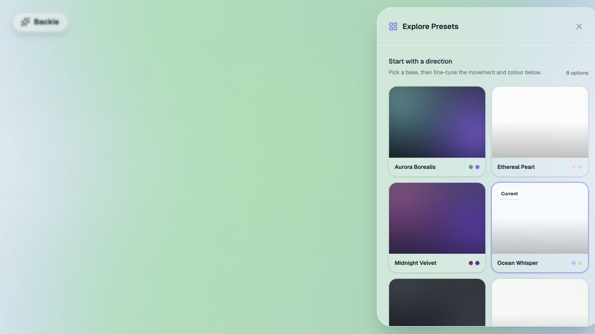

# Backie

Backie is a small browser tool for making animated, diffused gradient backgrounds.

**[Open Backie](https://backie.acroonic.com/)**



## How to use

1. Open **Explore Presets** and choose a starting look.
2. Open **Customise** to adjust composition, motion, blur, bloom, opacity, and blend mode.
3. Use the colour controls at the bottom to edit the canvas and aura colours. Lock a colour when it should stay fixed while randomising.
4. Open **Export** to copy a ready-to-use CSS or React snippet.

Your current settings are kept in the URL, so a design can be bookmarked or shared as a link. Backie runs entirely in the browser and does not require an account or API key.

Keyboard shortcuts: `Space` pauses or resumes the animation, `R` creates a new palette, and `Esc` closes the active panel.

## Development

Requirements: Node.js 20.19 or newer.

```sh
npm install
npm run dev
```

The development server runs at `http://localhost:3000`.

## Commands

- `npm run dev` starts the Vite development server.
- `npm run lint` runs the TypeScript checker.
- `npm run build` creates a production build in `dist/`.
- `npm run preview` serves the production build locally.

Backie is a client-only app. It does not need an API key, database, or server-side runtime.

## License

MIT. See [LICENSE](LICENSE).
